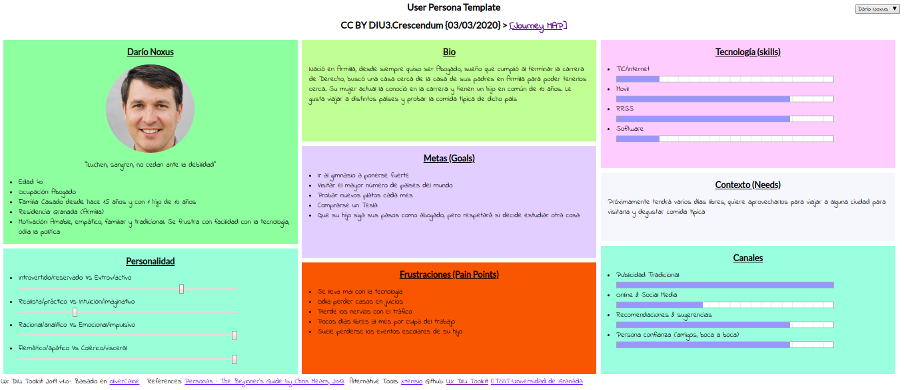
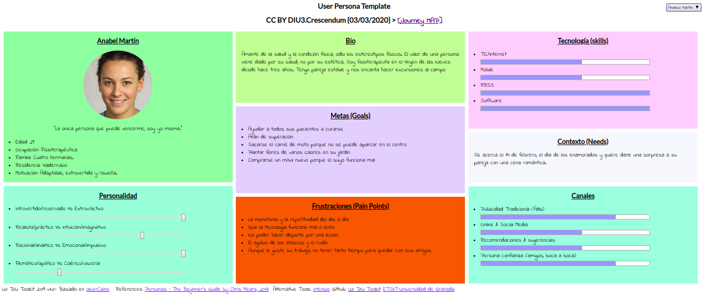
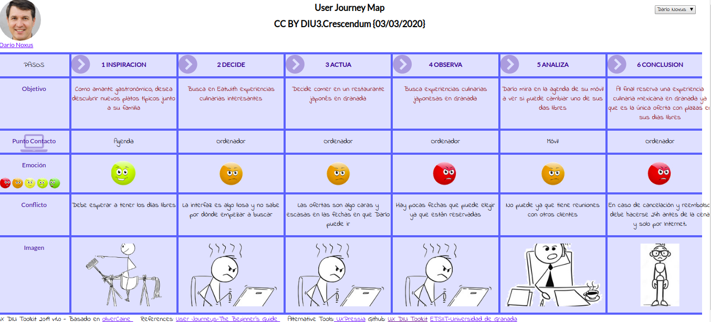
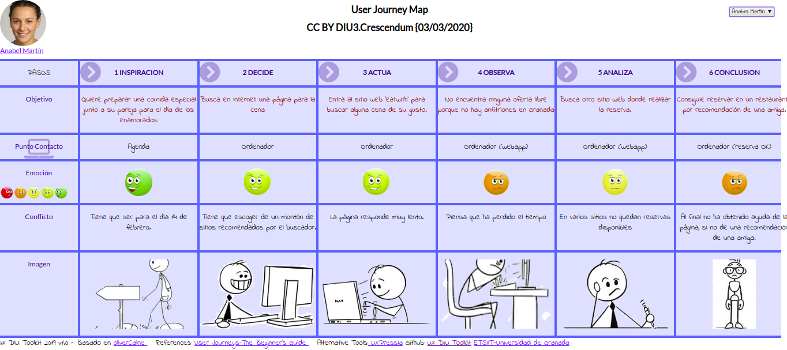

# Análisis competitivo:

Las aplicaciones de compartir ocio permiten al usuario vivir nuevas experiencias con otros usuarios con los mismos gustos. Se han seleccionado varias aplicaciones, de entre ellas facebook, meetup, emycet, artery, eatwith,... Finalmente se ha seleccionado eatwith por varios motivos:
    No es tan conocido como otras aplicaciones como Facebook o Meetup.
    Ni es muy general ni muy específico, se centra en experiencias sobre la comida, pero no se centra únicamente en comer, también tiene experiencias cocinando.
    A simple vista se han detectado posibles mejoras en el diseño de la página.
   
La aplicación eatwith proporciona experiencias culinarias, de entre ellas comidas privadas, tours y clases de cocina.

# Análisis personal:

## [Darío](https://pmartin97.github.io/indexP.html)
Se ha escogido a Darío debido a tener el perfil de un usuario maduro pero torpe con la tecnología. Le gusta viajar, desde siempre lo hizo a través de agencias de viajes pero hace poco descubrió que por Internet le puede salir más barato, el problema es su poca experiencia con los ordenadores.

## [Anabel](https://pmartin97.github.io/indexP.html)
Se ha escogido a Anabel porque representa el perfil de un usuario joven y hábil con la tecnología, al contrario que ocurre con Darío, un usuario que se frustra muy fácilmente con la tecnologa. También se ha escogido debido a su comportamiento mas excéntrico y alocado.

# Journey Map:
Se ha escogido un caso esporádico en el caso de Darío el cual tiene problemas al manejar un ordenador y un caso programado  por parte de Anabel la cual tiene experiencia para poder analizar en ambos casos la experiencia del usuario.

## [Darío](https://pmartin97.github.io/indexJ.html)

## [Anabel](https://pmartin97.github.io/indexJ.html)

# Usability review

Enlace al excel: https://github.com/Mxgang/DIU20/blob/master/P1/Usability-review-template.xls
Enlace al PDF: https://github.com/Mxgang/DIU20/blob/master/P1/Usability-review-template.pdf
Puntuación final: 78

La aplicación en cuanto a funcionalidad es correcta. El registro, las búsquedas y otras funciones son sencillas y fáciles de entender. En cuanto al aspecto visual, la página contiene demasiado contenido concentrado y en muchas ocasiones incluso innecesario. Otros aspectos extras como el cambio de idioma y moneda puede ser de de utilidad, el problema es que en la sección de ayuda no está traducido.

Los aspectos más graves son:
1. Vídeo en bucle en la página principal, es demasiado grande y provoca latencia, distracción y malestar.
2. Sección de ayuda no está traducido
3. Las búsquedas tienen pocos filtros y es todo muy genérico a la hora de buscar.
