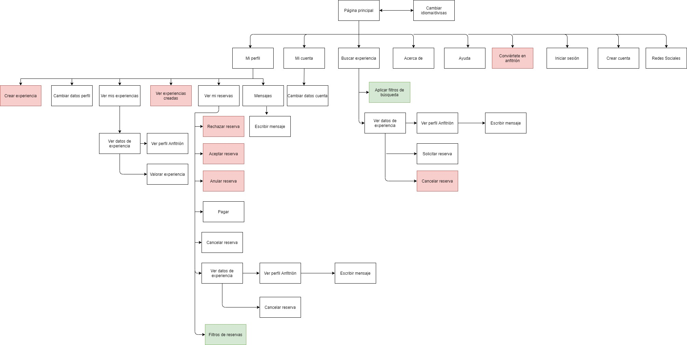
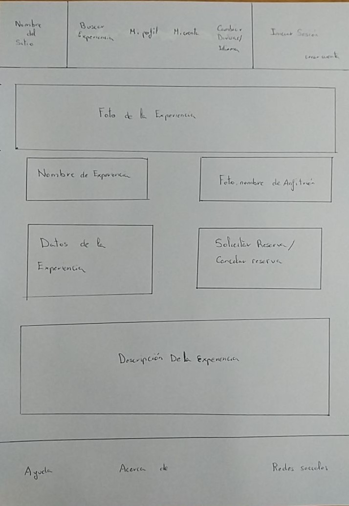
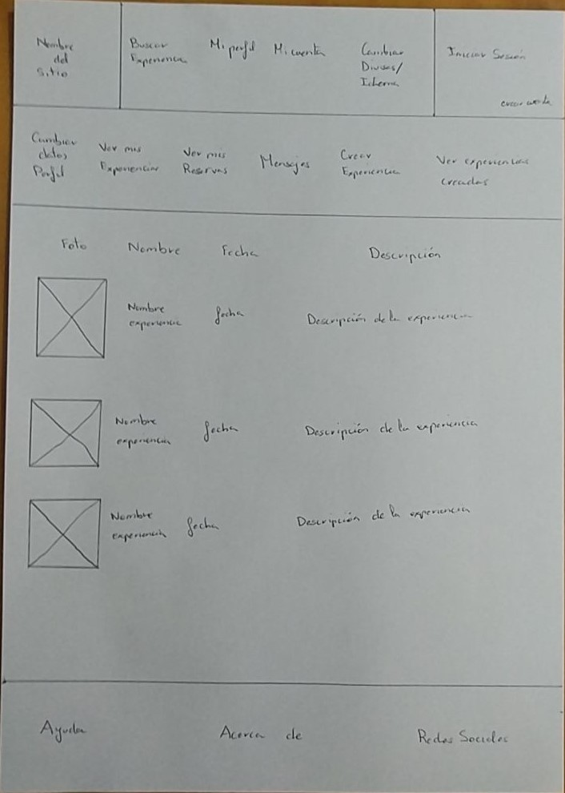
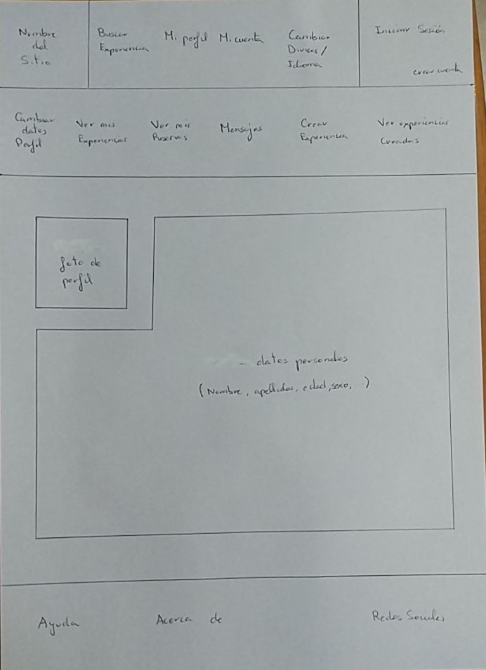
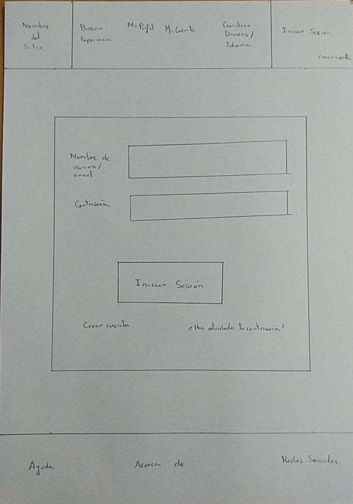
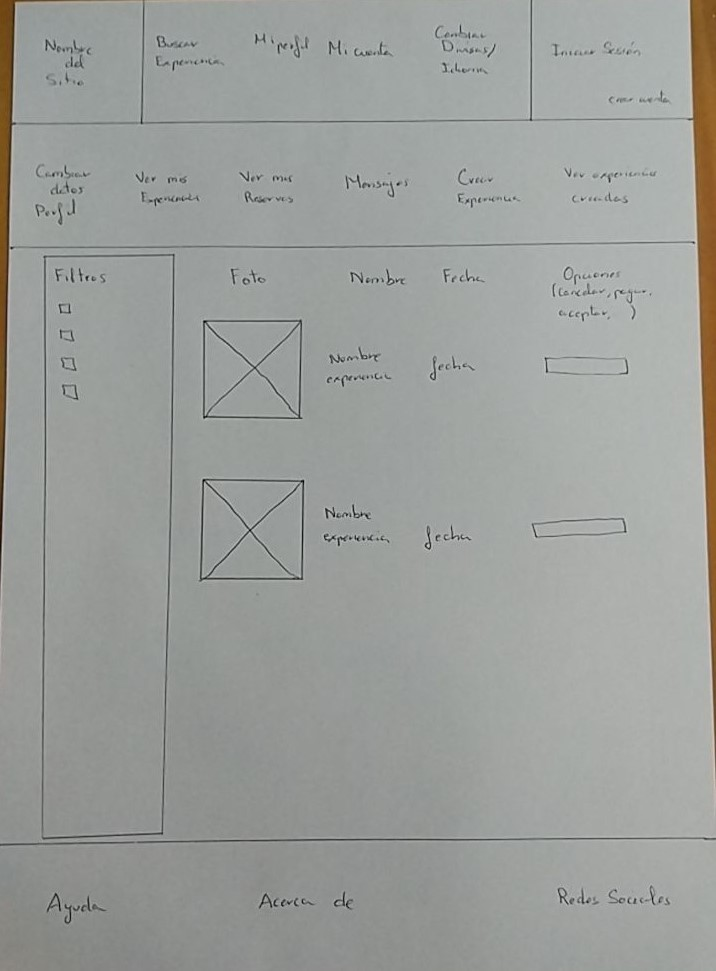

**1. Malla receptora de información**

Aquí la malla de información que hemos creado donde está toda la información acerca de la plataforma que hemos estado investigando, EatWith.

| Interesante/Relevante  | Críticas constructivas  | Preguntas a partir de la experiencia | Nuevas ideas |
| :---        |  :----:   | :----: | :----: |
| Permite ganar un dinero extra con tu hobbie.    | El vídeo de la página principal satura demasiado, sería recomendable cambiarlo por ejemplo por una imágen estática.  |   Anabel - ¿ Es posible realizar búsquedas solo a partir de un único filtro?   |  Comunicación - Añadir servicios en los idiomas en los que se muestra la información principal. El sistema de soporte y compartir en redes sociales no se encuentra en todos los idiomas.        |              
| Información abundante, útil y fiable      | El idioma del soporte solo está disponible en inglés, para un buen uso es necesario traducirlo al resto de idiomas que ofrece.  |  Darío - ¿ Hay aplicación android ? No veo nada en la página web. | Interacción - Reubicar elementos para evitar el uso de scroll.   |              
| Gran variedad de experiencias únicas.      | En general existen muchos elementos en cada página que pueden agobiar al usuario, sobre todo a la hora de necesitar hacer scroll, esto hace que no sea accesible.  |  Darío - ¿ Cómo puedo saber si la comida contiene gluten ? Mi mujer es celíaca.     |  UX Engagement - Una mejora en la latencia del sitio web. |              
| Aplicación para móviles disponible.        | Ciertos elementos no tienen un indicador claro de ser un enlace, por ejemplo el icono a la página principal.  | Anabel - ¿ Puedo compartir mi experiencia en Instagram ? No uso las redes sociales que deja la aplicación.  |  UX Engagement - Conseguir una mayor retención y uso agradable por parte de los usuarios.  |              

**2. User/Task flow**

En la siguiente tabla mostramos las distintas funcionalidades del sitio además de los grupos que lo van a usar y la frecuencia de uso, marcando en negrita tanto los usuarios como funcionalidades más importantes.

| Tareas\Grupo de usuarios | **`Usuarios consumidores`** | **`Usuarios anfitriones`** | Profesional |
| :---                     | :----:  | :----:  | :----:  | 
| **`Ver datos de experiencia`** |   H   |    M    |    M    |   
| **`Ver mis experiencias`**     |   M   |    M    |    M    |    
| **`Ver mi perfil`**            |   M   |    M    |    M    |    
| **`Iniciar sesión`**           |   M   |    M    |    M    |   
| **`Ver mis reservas`**         |   M   |    M    |    M    |    
| Crear experiencia nueva  |       |    M    |    H    |    
| Responder mensaje        |   L   |    M    |    M    |   
| Ver mi cuenta            |   M   |    M    |    L    |   
| Ver mensajes             |   L   |    M    |    M    |   
| Aplicar filtros de búsqueda    |   H   |    L   |    L    |    
| Cambiar datos perfil     |   L   |    M    |    M    |   
| Buscar experiencia       |   H   |    L    |         |   
| Pagar                    |   H   |    L    |         |    
| Seleccionar experiencia  |   M   |    L    |        |   
| Rechazar reserva         |       |    L    |    M    |    
| Ver perfil de Host       |   M   |    L    |         |   
| Solicitar reserva        |   M   |    L    |         |    
| Crear cuenta             |   L   |    L    |    L    |  
| Cambiar idioma/divisas   |   L   |    L    |    L    |   
| Convertirse en anfitrión |       |    L    |    L    |   
| Cancelar reserva         |   L   |    L    |         |    
| Valorar experiencia      |   L   |    L    |         | 
| Anular reserva           |       |    L    |    L    |   

**3. Arquitectura de la información**

**Sitemap**

Estructura que se va a usar para el diseño y desarrollo del sitio web.

__Labelling__

Información detallada de todas las funcionalidades del sitio web.

| **Label**  |  **Scope Note**   |   
| :----:  | :----: |
| Página principal        |   Página de inicio del sitio web, contiene los elemento comunes a las demás páginas (header, footer)   |   
| Cambiar idioma/divisas            |   Botón que permite cambiar el idioma de la página y la divisa a la hora de calcular precios   |
| Mi perfil | Botón que permite acceder a la información de tu perfil | 
| Mi cuenta | Botón que permite acceder a la información de tus credenciales de acceso |  
| Buscar experiencia | Este botón te permite hacer una búsqueda de una experiencia dados unos párametros |  
| Acerca de | Botón que muestra la información del sitio, aviso legal, términos y condiciones y política de privacidad |  
| Ayuda | Botón para poder contactar con el servicio de atención al cliente y poder resolver dudas |  
| **Conviértete en anfitrión** |  Acción condicional: solo se permite su uso a usuarios no anfitriones. Con este botón siendo usuario puedes convertirte en anfitrión y crear experiencias |  
| Iniciar sesión | Botón que permite iniciar sesión introduciendo nombre de usuario o email y contraseña, además si te has olvidado la contraseña habrá un botón estilo "¿has olvidado la contraseña?" |
| Crear cuenta | Botón para crear una cuenta nueva introduciendo una serie de datos de un formulario | 
| Redes sociales | Botones para acceder a las redes sociales del sitio como Facebook, Twitter, Instagram entre otros |  
| **Crear experiencia**  | Acción condicional: solo se permite su uso a usuarios anfitriones. Botón que permite crear una experiencia siendo anfitrión, dando una serie de datos de un formulario |  
| Cambiar datos perfil  | Sección que permite cambiar información de tu perfil |  
| Ver mis experiencias | Página que contiene todas las experiencias que has realizado  |  
| **Ver experiencias creadas** | Acción condicional: solo se permite su uso a usuarios anfitriones. Página que permite ver las experiencias creadas por un anfitrión|  
| Ver mis reservas | Página donde puedes ver las reservas de experiencias que tienes |
| Mensajes | Página que contiene los mensajes enviados y recibidos con otros usuarios de la plataforma |  
| Cambiar datos cuenta | Sección de página que permite modificar los cambios de cuenta del usuario con un formulario y un botón de guardado |  
| **Aplicar filtros de búsqueda** | Acción opcional: se permite su uso para obtener resultados más específicos. Conjuntos de filtros **opcionales** para realizar la búsqueda de una experiencia. De entre ellos destacamos: fecha, número de invitados, precio, reserva instantánea, tipo de evento, tipo de cocina, idioma del anfitrión, lugar y régimen alimenticio.  | 
| Filtros de reservas | Conjunto de filtros para encontrar reservas según si están pagados, confirmados, rechazados... |  
| Ver datos de experiencia | Página que muestra todos los datos relevantes de una experiencia como su nombre, fecha, anfitrión, descripción, un botón para realizar una reserva, etc.|  
| Ver perfil anfitrión | Página que muestra los datos públicos de un usuario anfitrión | 
| Valorar experiencia | Formulario que permite valorar la calidad de la experiencia culinaria realizada |  
| **Rechazar reserva** | Acción condicional: solo se permite su uso a usuarios anfitriones. Botón que permite rechazar la petición de reserva de un usuario que haya realizado una reserva en la experiencia organizada por el anfitrión   |  
| **Aceptar reserva** | Acción condicional: solo se permite su uso a usuarios anfitriones. Botón que permite aceptar la reserva de un usuario a un evento organizado por el anfitrión |  
| **Anular reserva** | Acción condicional: solo se permite su uso a usuarios anfitriones. Botón que permite anular una reserva en caso de que al anfitrión le haya surgido un problema que le impida organizar la experiencia |  
| Pagar | Formulario que permite la transacción del pago |  
| **Cancelar reserva** | Acción condicional: solo se permite su uso a usuarios que han solicitado reserva en una experiencia. Botón que permite cancelar la reserva de una experiencia si el usuario decide retractarse o no puede ir al evento |  
| Solicitar reserva | Botón que permite solicitar una reserva en una experiencia culinaria |  
| Escribir mensaje | Formulario que permite comunicar un mensaje a un usuario de la plataforma | 

**4. Bocetos Lo-Fi**

Bocetos realizados a partir de las funcionaldiades más importantes del Task Flow:

  1. Ver datos de experiencia.  
    
  
  
  
  2. Ver mis experiencias.  
     
  
  
  3. Ver mi perfil.   
      
  

  4. Iniciar sesión.  
     
  
  
  5. Ver mis reservas.  
   
  

**5. Repositorio del Equipo**

[Equipo: Crescendum](https://github.com/Mxgang/DIU20)
